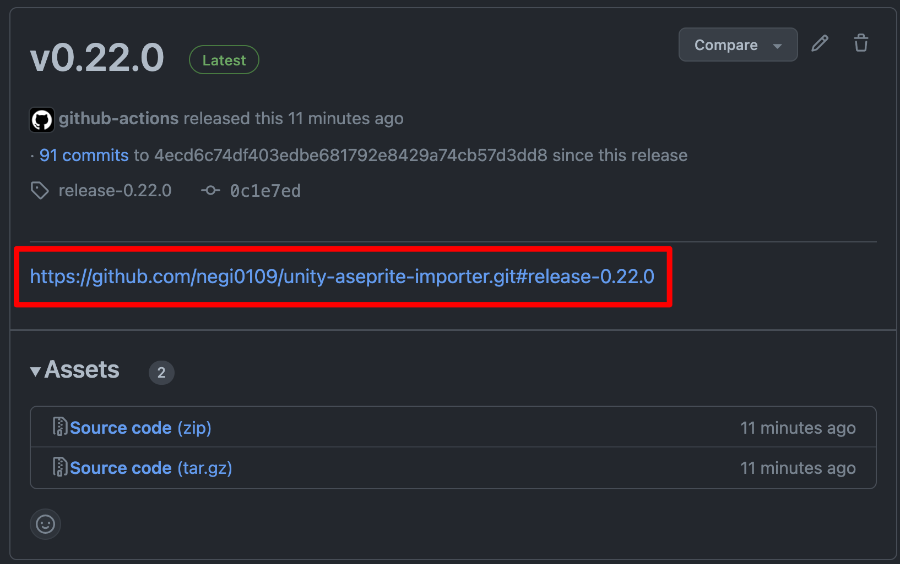
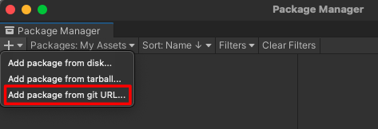

# Install
Unity package managerからのインストール方法

### 1. インストール用のリンクを取得
1. releases のページに移動
   https://github.com/negi0109/unity-aseprite-importer/releases

2. 利用したいバージョンの本文に含まれる github リンクを取得
   

### 2.　UnityPackageManagerからインストール
1. Window > PackageManagerからPackageManagerを起動

2. +ボタンから`Add package from git URL`を選択

3. 入力欄に取得したgithubリンクを貼り付ける
