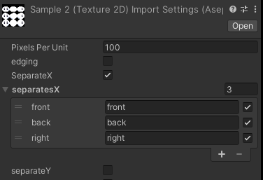
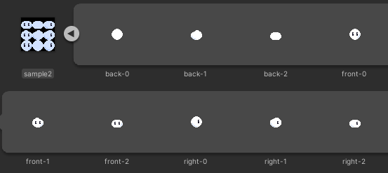
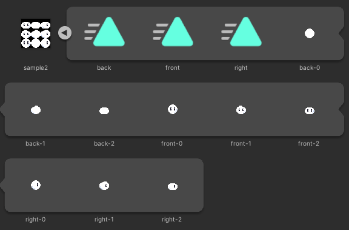

# aseprite-importer
Unity上でasepriteファイルを扱えるようにするエディタ拡張

- 開発中のため随時必要機能は下記プロジェクトで管理しています。
  - https://github.com/negi0109/unity-aseprite-importer/projects/1

## Install
Unity Package Managerから追加
- リンク先ページに記載のURLを追加
    - https://github.com/negi0109/unity-aseprite-importer/releases/latest
- 過去のバージョンは [releases](https://github.com/negi0109/unity-aseprite-importer/releases) から確認・利用可能

## Features
- asepriteファイル上の1フレームごとのスプライト (スプライトシートの作成)
- スプライトの分割
- アニメーションの利用

## How To
### スプライトの分割
- 列数 (separates)の指定
- 列ごとの名前の設定

### アニメーションの利用
- exportAnimation を指定

