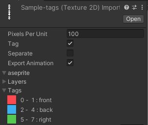

# aseprite-importer
Unity上でasepriteファイルを扱えるようにするエディタ拡張

- 開発中のため随時必要機能は下記プロジェクトで管理しています。
  - https://github.com/users/negi0109/projects/8/views/1
  - 必要な機能は満たせており試運転中です。

### 0バージョン時点でのバージョン運用について
フォーマットは`0.xx.yy`
- xxバージョンは後方互換性の保たない更新がある可能性の際に更新されます
   > ex. アップデート時にアニメーションやスプライトなどの内容に変更があったり、他のGameObjectからのリンクなどが切れてしまう場合があります
- yyバージョンは後方互換性を保った細かいバグ修正やUI追加、機能追加など
     - 軽い機能追加なども含みますが、未使用時の挙動は変更しません

## Install
Unity Package Managerから追加 ([図解つきの詳細はこちら](README-Install.md))
- 最新版
    - https://github.com/negi0109/unity-aseprite-importer.git#release
- 過去のバージョンは [releases](https://github.com/negi0109/unity-aseprite-importer/releases) から確認・利用可能
  - 開発中のため最新版ではなくrelease上のgithubリンクでの利用を推奨します

## Features
- asepriteファイル上の1フレームごとのスプライト (スプライトシートの作成)
- スプライトの分割
- アニメーションの利用

## Features
Unity上でAseprite(.ase, .aseprite)が利用できるようになるエディタ拡張です.

画像ファイルなどと同様Assetsフォルダ上にasepriteファイルを配置すると利用可能です

### アニメーションの利用
- exportAnimation を指定

#### tagの読み込み
Tag を指定で利用できます

各タグ単位でAnimationの生成を行えます

### 縁取り (edging)
スプライト描画時端にゴミが表示される場合に１px分の透明pixelを追加するためのオプション

### スプライトの分割
aseprite上の画像を分割し複数スプライトとして扱いたい場合に用います
- 利用したい際は分割したい軸に合わせて separateX, separateYの指定
- 列や行ごとの名前の設定

- 下記のように分割した単位でアニメーションやスプライトが生成される

## License
本エディタ拡張のソースコードはMITライセンスですが、
ゲームなどのビルドに含まれるのは生成されたSpriteやAnimationClipなどのみのため、ライセンスの提示は不要です。
